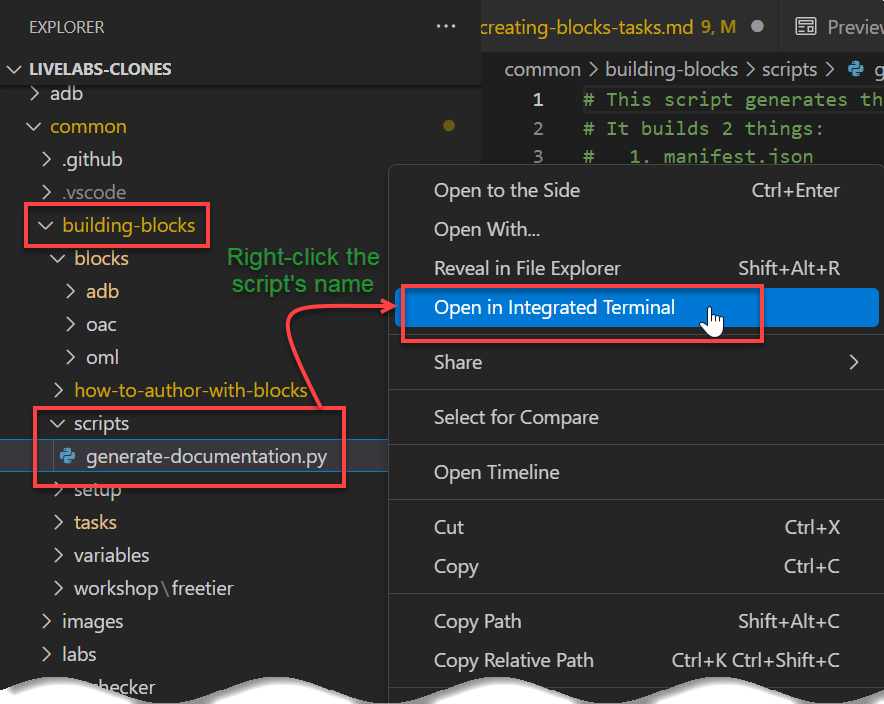
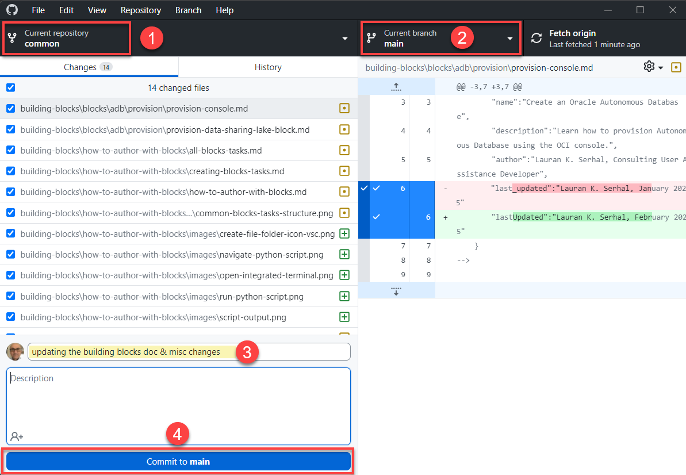

# Creating Blocks and Tasks

## Introduction

**Everyone should contribute to Blocks and Tasks!** If you are creating a workshop and you have labs or tasks that you think will be useful to others - share them! It's easy - here's how.

## Create your lab's markdown

Create your workshop as you normally would. Try to keep content generic enough so that it can be used in multiple contexts. And, it may mean using variables instead of hardcoding names. Create the common block or task in the appropriate folder (repo). For example, if you are creating a common task for the an ADB workshop, you'll create the common task in the **`common > building-blocks > tasks > adb`** folder.

To create a new folder or file in the your chosen folder such as the adb folder, click the **New File...** or **New Folder...** icons in Visual Studio Code.


  

### Create a block or task?

The block is equivalent to a lab. It may be difficult not to provide workshop specific information - especially in the introduction. If you can keep the content generic, then create a block!

Very frequently, a lab has tasks that are very generic. For example, Navigating to the object storage service is the same. So, make that a task and use variables to specify the compartment and bucket. Now, any lab that needs to navigate to the object store can simply include the task in their markdown. It's a one liner! And, when the UX changes, one update to the task will update all the workshops that use the task.

Don't forget to use tasks when creating your block :).

## Add a comment block to your markdown

The one addition you'll need to make to your markdown is a comment block. This comment block provides a title and description for your block or task. The documentation's master list of blocks and tasks is derived from these comment blocks.

    **Important:** _You must use the exact spelling of the comment block fields names. Pay attention to the `lastUpdated` field where the camel case convention name is used. If you don't use the exact spelling, your common block or task will not appear in the list of available blocks or tasks._

Example block:
```
&lt;!--
    {
        "name":"Provision an ADB instance for the Data Sharing and Data Lake workshops",
        "description":"Learn how to provision Autonomous Database using the OCI console.",
        "author":"Lauran K. Serhal, Consulting User Assistance Developer",
        "lastUpdated":"Lauran K. Serhal, February 2025"
    }
-->
# Connect with SQL Worksheet

## Introduction

In this lab, you will connect to Autonomous Database using the SQL Worksheet and explore its capabilities.

Estimated Time: 5 minutes
```

## Save your markdown to the building-blocks workshop

Save your markdown to the appropriate repo folder (block or task) under the **building-blocks** root folder. Each cloud service has its own folder in either the blocks or tasks parent folder. If your cloud service's folder doesn't exist yet, then simply add a new folder.

```
adb
.. building-blocks
.... blocks
........adb
........oac
.... tasks
........adb
........iam

```

## Regenerate the documentation
After you create (or modify or delete too) new blocks and tasks, regenerate the documentation by running the **generate-documentation.py** python script found in the `/adb/building-blocks/scripts` folder. This script generates much of the how-to-author-with-blocks documentation.

1. Navigate to the `/adb/building-blocks/scripts` folder.

2. Right-click the **generate-documentation.py** file name, and then select **Open in Integrated Terminal** from the context menu.



3. Run the script. Copy the following code and then paste it on the command prompt.

    ```
    <copy>
    python generate-documentation.py
    </copy>
    ```

    

    The script output is displayed.

    

4. Navigate to and review the following to display any additions, deletions, or edits that you might have made:

    * `adb.md`
    * `how-to-author-with-blocks.md`
    * `manifest.json`

5. Push your changes to your fork. In this example, we are using GitHub Desktop.

    

    

6. 
