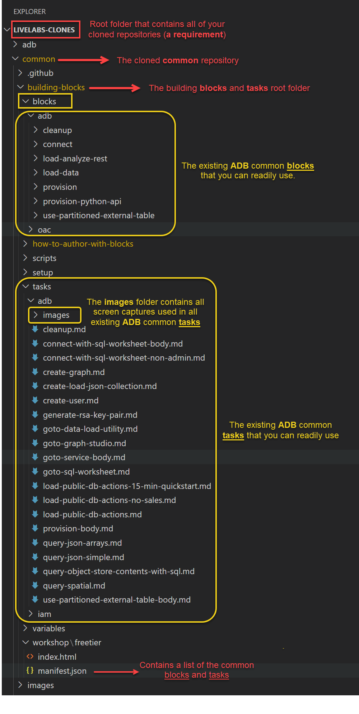
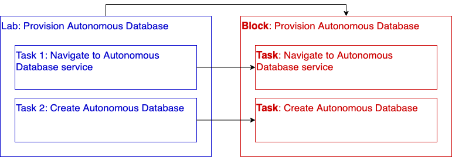

# Authoring LiveLabs Workshops with Building Blocks and Tasks

## Introduction
LiveLabs is a great environment for publishing workshops. There are a few things that we are addressing to satisfy the following requirements:

* Make it easy for customers to find and perform specific ADB tasks
* Simplify and accelerate the authoring of workshops
* Improve on-going maintenance of workshops
* Promote consistency across workshops

Building Blocks are a way to enhance both the workshop development and customer experience. This workshop provides the details on how authors can use Building Blocks and Tasks to accelerate workshop development.

## Introduction to Building Blocks and Tasks
As a LiveLabs workshop author, there are two types of components you may want to take advantage of:

* Building **Block** (common block), and/or
* Building **Task** (common task)

>**Note:** Both Building **Blocks** and **Tasks** are located in the **`common`** repository; therefore, in this workshop we will refer to Building Blocks and Tasks as **`common`** **blocks** and **tasks** interchangeably.

Let's look at the folder structure for the Building Blocks and Tasks:

  

Let's examine the above folders structure:

* **`livelabs-clones`:**    
This is the root folder that contains all of your repositories that you use in your workshops. The name of this folder is up to you. In our example, this folder contains the **`adb`**, **`common`**, **`oci`**, and **`sprints`** repositories. Having a root or parent folder that contains all of your cloned repos is a
pre-requisite; _otherwise, you'll have issues implementing and running common blocks and tasks_.

* **`common` repository:**    
This is the the repo that contains the common Building Blocks and Tasks among other things.

* **`building-blocks`:**    
This is the root folder that contains all common blocks and tasks.

* **`blocks`:**    
This is the folder that contains all common blocks.

* **`tasks`:**    
This is the folder that contains all common tasks.

### Pre-requisite 1 to Using Building Blocks and Tasks

To use building blocks, your repositories where you save your LiveLabs workshops (such as the adb, common, and other folders) must be under a root folder that contains all of the repositories (repos) that you need for your workshops. You can choose your own root folder name. In our example, we created a parent folder named **livelabs-clones** folder under the **Documents** folder in MS-Windows. We will be creating workshops that will use the adb, common, oci, and sprints repos.


_**Important:_** _Prior to using Building Blocks, most of us authoring LiveLabs workshops didn’t use the concept of a root folder to store all our clones (repos that we need); instead, we cloned each repo under the Documents folder (or some other folder of your choice) in Windows. If you have this folder structure, you'll need to delete your clones and re-clone the folders and save them under the same root folder._

Let's examine these two concepts and how they map to your workshop development:



Just as a _lab_ is comprised of _multiple tasks_, a _Block_ is comprised of multiple Tasks.

For example, the **provision-console.md** common block has two common tasks:

* **goto-service-body.md:** Selects the ADB Service from the OCI menu
* **provision-console-body.md:** Creates the ADB instance

In this case, there is a **Building Block** that directly maps to this lab. You can simply take this Building Block, add it to your workshop's manifest, update LiveLab variables (the database name, # CPUs, etc.) to match your lab's requirements, and your done. In the future, when updates are made to ADB provisioning, your lab will update automatically when the Building Block is updated.

**Tasks** map to the individual lab tasks. In this case, there are two Tasks in the Block. Because a Task is a component, it can be used in this or multiple Blocks. And, its usage is not limited to Blocks. You can use the Task directly in your lab.

Having this Task is really useful because numerous labs (including ADB Provisioning) navigate to the ADB Service. Since this is a common task, we've created a Task for it. When that navigation changes, the Task will be updated and all labs and Blocks that used that Task will be updated automatically.

Hope it's clear - Blocks and Tasks will simplify your workshop authoring and on-going maintenance.

## How Building Blocks use Tasks
Let's take a look at the markdown for a Provisioning an Autonomous Database common block named **`provision-console.md`** that uses two common tasks:

* `goto-service-body.md`
* `provision-console-body.md`


**Here is markdown specific to my workshop.**

```md
Let's create an ADB instance.

&num;# Task 1: Choose Autonomous Database from the services menu
[]&lpar;include:adb-goto-service-body.md)

&num;# Task 2: Create the Autonomous Database instance
[]&lpar;include:adb-provision-console-body.md)

```

As you can see, the markdown for this block is pretty simple. It includes two common Tasks:

1. Go to the service, and

2. provision using the console.

It may be that the format of this Block does not meet your workshop requirements. No problem. Your workshop markdown can use these Tasks in a similar way to the Building Block. Simply include the Task within your markdown.

**See below for how the markdown was rendered**

## Example: Provision using the OCI Console
Here is markdown specific to my workshop.

Let's create an ADB instance.

### Task 1: Choose Autonomous Database from the services menu
[](include:adb-goto-service-body.md)

### Task 2: Create the Autonomous Database instance
[](include:adb-provision-body.md)

## The workshop manifest and variables

### variables.json
Workshops have different requirements. Database names, OCPUs and other options may differ. LiveLabs uses variables to allow authors to update content. It may be that you need to make updates to the Task in order to make it more flexible; please share any required updates with the LiveLabs team.

The master list of all variables used in Blocks are stored in the [/building-blocks/variables/variables.json](../variables/variables.json) file. Copy this variables.json file to your own workshop directory if the default variable values need changing:

variables.json
```
{
    "db_name": "MYQUICKSTART",
    "db_display_name":"MyQuickStart",
    "db_ocpu": "1 OCPU",
    "db_storage": "1 TB",
    "db_name_livelabs": "MOVIE+your user id",
    "db_name_livelabs_example": "MOVIE2252",
    "db_workload_type":"Autonomous Data Warehouse"
 }
 ```

###  manifest.json
The manifest.json file describes the content of your workshop. It also contains references that will be used in your markdown. These references include:
* ```include```: these are markdown files that will be referenced. Tasks or Blocks will be listed here
* ```variables```: these are the variables that will be referenced in your markdown

 See below for an example ```manifest.json``` file and how these two attributes are referenced:
```
 {
    "workshoptitle": "LiveLabs Building Blocks",
    "include": {
      "adb-provision-body.md":"/common/building-blocks/tasks/adb/provision-body.md",
      "adb-goto-service-body.md":"/common/building-blocks/tasks/adb/goto-service-body.md"
    },
    "variables": ["/common/building-blocks/variables/variables.json"],
    "help": "livelabs-help-db_us@oracle.com",
    "tutorials": [
        {
          "title": "Authoring using Blocks", 
          "type":"freetier",        
          "filename": "/common/building-blocks/how-to-author-with-blocks/how-to-author-with-blocks.md"
        }
    ]
}
```

## Acknowledgements
* **Authors:
    * Lauran K. Serhal, Consulting User Assistance Developer
    * Marty Gubar, Product Manager
* **Last Updated By/Date** Lauran K. Serhal, February 2025